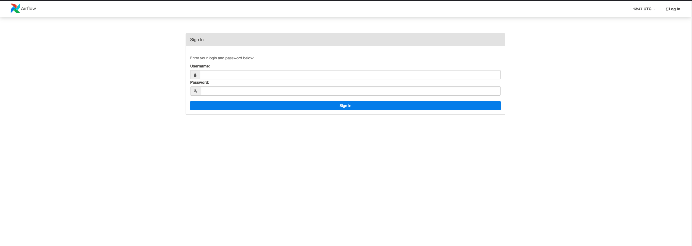
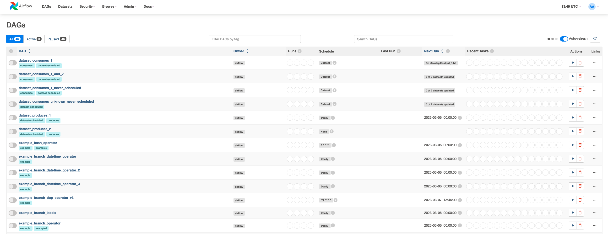

# Airflow-Schedule

## Execute

- To execute this project run the following command:

```bash
docker compose up airflow-init
```

- Run docker compose up to start the airflow scheduler and webserver

```bash
docker compose up
```

- After this, you can access the airflow dashboard at http://localhost:8080




